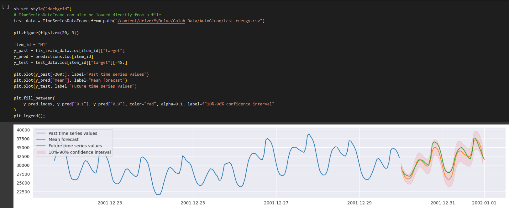
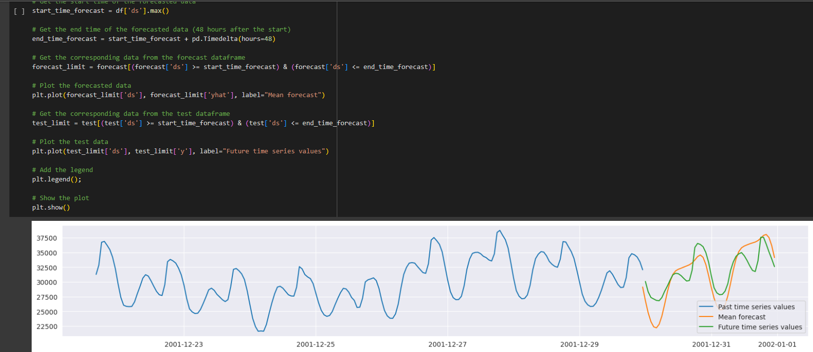
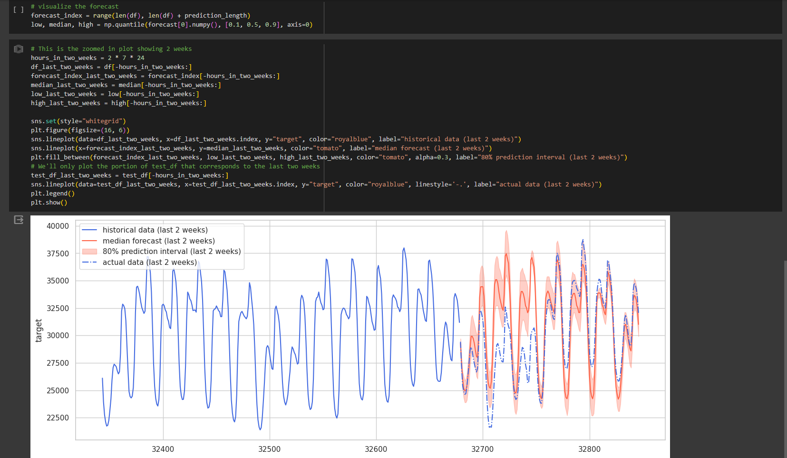
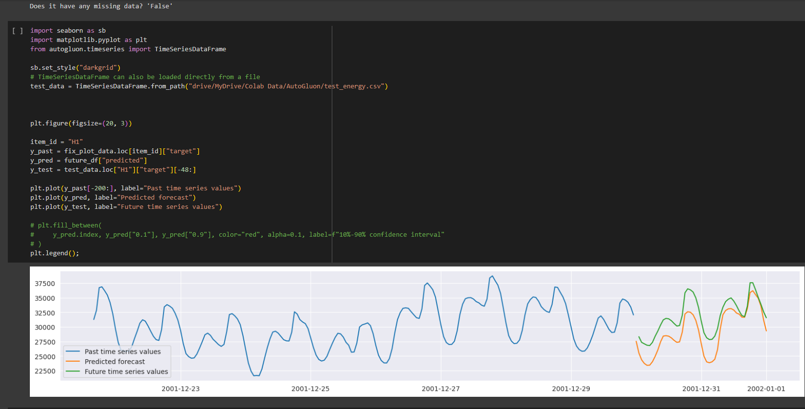

# ML model and Low Code Timeseries Forecast Comparison	

This is a simple repository containing notebooks showcasing the latest in AutoML, Low Code and Automated ML Forecasting techniques.

## How to use
1. Copy `data/utils.py` to the root of your Google Drive
2. Upload `data` to your Google Drive at `Colab Data/AutoGluon/`
3. Upload the notebooks to colab.google.com

They should then run

# Results Summary:

## AutoGluon
By far the easiest to implement (could be done in 7 lines of code), has impressive accuracy on this and other solutions
 (https://pub.towardsai.net/revolutionising-machine-learning-achieving-top-4-in-kaggle-with-autogluon-in-just-7-lines-of-code-ab860a9b9ad7)
 

## Prophet
Also relatively easy to implement however accuracy out of the box is not great, can be tuned but probably not worth spending the time on

## Chronos
Also easy to implement, above average accuracy, could be tweaked to get better accuracy I am sure but has a limit of 64 forecast horizon

## Random Forest
Traditional ML Forecast method with some hyperparameter tuning - Good accuracy but much more complicated to implement.

