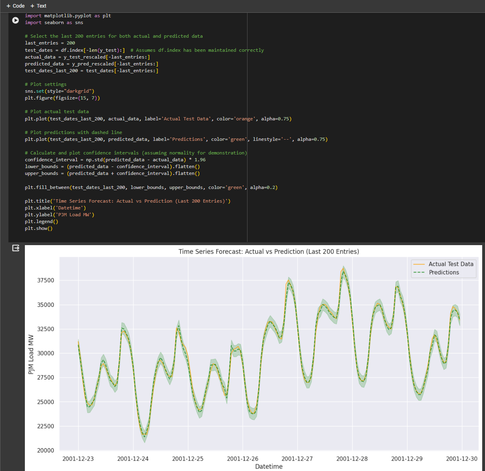

# ML model and Low Code Timeseries Forecast Comparison	

This is a simple repository containing notebooks showcasing the latest in AutoML, Low Code and Automated ML Forecasting techniques.

## How to use
1. Copy `data/utils.py` to the root of your Google Drive
2. Upload `data` to your Google Drive at `Colab Data/AutoGluon/`
3. Upload the notebooks to colab.google.com

They should then run without any changes - make sure you are using a CUDA enabled Kernel in Colab.

### Collaborating.

Please feel free to add new models to this repository as they come and use the same energy data that the other tests have used.
Please follow the Seaborn structure for visualisation where possible so its a bit easier to read and compare across models (do as I say, not as I do)

# Results Summary:

## AutoGluon
By far the easiest to implement (could be done in 7 lines of code), has impressive accuracy on this and other solutions
 (https://pub.towardsai.net/revolutionising-machine-learning-achieving-top-4-in-kaggle-with-autogluon-in-just-7-lines-of-code-ab860a9b9ad7)
 

## Prophet
Also relatively easy to implement however accuracy out of the box is not great, can be tuned but probably not worth spending the time on

## Chronos
This is a bit different than the others, it is actually a timeseries GPT model
Also easy to implement, above average accuracy, could be tweaked to get better accuracy I am sure but has a limit of 64 forecast horizon

## Random Forest
Traditional ML Forecast method with some hyperparameter tuning - Good accuracy but much more complicated to implement.

## GRU DNN + Keras
Another traditional ML forecast method - this is incredibly accurate but has a long training time and the model seems somewhat overfit, I will try with another dataset here to see
if it is actaully this good.
This took significantly longer to get right as the RNN model from Darts just didnt seem to work, so using Keras was easier and I was able to rationalise down the final code.

## LSTM RNN + Keras
This is a more traditional RNN approach - the accuracy on the trained data seems good but it seems to pick up some strange increases when comparing into the future, this is likely because I am using the 
same incremental forecast approach as GRU which might not be suitable, either way for a low code approach this seems like it would need more training

## AutoTS
This is another AutoML timeseries forecasting data that can build Ensemble models like AutoGluon, accuracy is above average but could definitely be tweaked beyond what I have done in this notebook
Training time was relatively long (1 hour CPU) - enabling GPU on this seemed overly complex.

# Failures
These models basically failed enough where I couldnt be bothered to chase up to get them working

## Ray
Unusable - crashes kernel each time so consider this code just a placeholder. Seems to be a common theme on their support forums: https://discuss.ray.io/t/simple-hello-world-example-crashes-badly/13272

